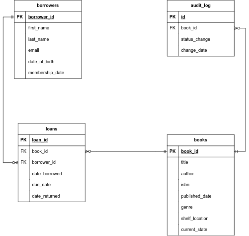

## **Library Management System: Database Project**

## **Background**:

 A local library wishes to transition from their traditional book-keeping to a more robust digital system. They want a platform to efficiently track books, borrowers, loans, returns, and offer insights into borrowing trends.

## **Objective**:

Design and implement a relational database using MS SQL that supports the library's operations and offers extensive querying capabilities.

## **Requirements**:

### **1. Design an Entity Relationship Model (ERM) Diagram**:

- **Entities**: Illustrate entities: **`Books`**, **`Borrowers`**, and **`Loans`**.
- **Attributes**: Detail attributes for each entity.
- **Relationships**: Exhibit connections between entities.
- **Connectivity and Cardinality**: Notate the relationship type between entities.
- **Keys**: Mark primary (PK) and foreign keys (FK).
- **Tools**: Opt for ERDPlus, Lucidchart, or similar tools. Include the diagram in the repository.

### **2. Design the Relational Schema using MS SQL**:

- **Books**:
    - BookID (PK)
    - Title
    - Author
    - ISBN
    - Published Date
    - Genre
    - Shelf Location
    - Current Status ('Available' or 'Borrowed')
- **Borrowers**:
    - BorrowerID (PK)
    - First Name
    - Last Name
    - Email
    - Date of Birth
    - Membership Date
- **Loans**:
    - LoanID (PK)
    - BookID (FK)
    - BorrowerID (FK)
    - Date Borrowed
    - Due Date
    - Date Returned (NULL if not returned yet)

### **3. Build and Seed the Database**:

- Construct the database in MS SQL.
- Seed with fictional data: Populate 1000 books, 1000 borrowers, and 1000 loan records. **Include DML scripts for seeding** in the GitHub repository. (Try generating the data by yourself and make sure it is consistent and preferably meaningful. You may use some websites, tools, or scripts to generate this data).

### **4. Complex Queries and Procedures**:

</aside>

1. **List of Borrowed Books**: Retrieve all books borrowed by a specific borrower, including those currently unreturned.
2. **Active Borrowers with CTEs**: Identify borrowers who've borrowed 2 or more books but haven't returned any using CTEs.
3. **Borrowing Frequency using Window Functions**: Rank borrowers based on borrowing frequency.
4. **Popular Genre Analysis using Joins and Window Functions**: Identify the most popular genre for a given month.
5. **Stored Procedure - Add New Borrowers**:
    - **Procedure Name**: **`sp_AddNewBorrower`**
    - **Purpose**: Streamline the process of adding a new borrower.
    - **Parameters**: **`FirstName`**, **`LastName`**, **`Email`**, **`DateOfBirth`**, **`MembershipDate`**.
    - **Implementation**: Check if an email exists; if not, add to **`Borrowers`**. If existing, return an error message.
    - **Return**: The new **`BorrowerID`** or an error message.
6. **Database Function - Calculate Overdue Fees**:
    - **Function Name**: **`fn_CalculateOverdueFees`**
    - **Purpose**: Compute overdue fees for a given loan.
    - **Parameter**: **`LoanID`**
    - **Implementation**: Charge fees based on overdue days: $1/day for up to 30 days, $2/day after.
    - **Return**: Overdue fee for the **`LoanID`**.
7. **Database Function - Book Borrowing Frequency**:
    - **Function Name**: **`fn_BookBorrowingFrequency`**
    - **Purpose**: Gauge the borrowing frequency of a book.
    - **Parameter**: **`BookID`**
    - **Implementation**: Count the number of times the book has been issued.
    - **Return**: Borrowing count of the book.
8. **Overdue Analysis**: List all books overdue by more than 30 days with their associated borrowers.
9. **Author Popularity using Aggregation**: Rank authors by the borrowing frequency of their books.
10. **Genre Preference by Age using Group By and Having**: Determine the preferred genre of different age groups of borrowers. (Groups are (0,10), (11,20), (21,30)…)
11. **Stored Procedure - Borrowed Books Report**:
    - **Procedure Name**: **`sp_BorrowedBooksReport`**
    - **Purpose**: Generate a report of books borrowed within a specified date range.
    - **Parameters**: **`StartDate`**, **`EndDate`**
    - **Implementation**: Retrieve all books borrowed within the given range, with details like borrower name and borrowing date.
    - **Return**: Tabulated report of borrowed books.
12. **Trigger Implementation**
- Design a trigger to log an entry into a separate **`AuditLog`** table whenever a book's status changes from 'Available' to 'Borrowed' or vice versa. The **`AuditLog`** should capture **`BookID`**, **`StatusChange`**, and **`ChangeDate`**.
1. **SQL Stored Procedure with Temp Table**:
- Design a stored procedure that retrieves all borrowers who have overdue books. Store these borrowers in a temporary table, then join this temp table with the **`Loans`** table to list out the specific overdue books for each borrower.

### BONUS:

- **Weekly peak days**: The library is planning to employ a new part-time worker. This worker will work 3 days weekly in the library. From the data you have, determine the most 3 days in the week that have the most share of the loans and display the result of each day as a percentage of all loans. Sort the results from the highest percentage to the lowest percentage. (eg. 25.18% of the loans happen on Monday...)

## **Complex Queries and Procedures Solutions Rationale**:
1. join books with loans on book_id to obtain books for the required borrower and select distinct them.
2. create a cte that stores the borrower_id and the count of the non-returned books then join borrowers with this cte on borrower_id and filter the result where loan_count >= 2 and select borrower details.
3. left-join borrowers with loans on borrower_id (left-join since a borrower may not borrow any book) then group the result by borrwer_id and select that id with loan count to illustrate and give the borrwer a rank based on the count of loans descending.
4. make a cte that stores the result of the following:
join loans and books on book_id and group the result by the month of the year of borrowing and book genre then select that info with count of loans and give a rank for each partition of (year, month) ordered by the count,
then from that cte select genre and borrow count such that month is the required month and rank is 1 (rank begins always from 1 and the highest count in the cte gets the lowest rank number).
5. in the created procedure, first check if a borrower with the same email exists, if he/she exists then return the error message 'The given email already exists' else insert a new borrower with the values provided and return the id of the newly-inserted borrower.
6. in the created function, calculate the overdue days and if the result is null (the loan does not exist) return 0 as a non-existing loan obviously does not have overdue fees. if not, if overdue days was <= 30 then overdue fees are $days else $(30 + (days - 30) * 2) and return the result.
7. in the created function, just return the count of all loans such that they are for the same book_id provided.
8. join books, loans, and borrowers and filter the results where date_returned is null and overdue days > 30 then select book and borrower details.
9. left-join books and loans on book_id (left join as book may not be borrowed yet) group the result by author then select the author and give him/her a rank based on the count of loans descending.
10. create a cte for age range for each borrower then another one, in this one, for each (age_range, genre) calculate the number of distinct borrowers, then select select the genre for the age_range having the maximum of these counts.
11. in the created procedure, join loans, books, and borrowers and filter the results where date_borrowed is between the provided startdate and enddate and select book details, borrower's name, and date_borrowed.
12. the created trigger fires after books table is updated, it does the following:
retrieve the old_state and new_state of the updated book, if they are not equal then retrieve the id of the book and store id, new_state, and current date in the audit_log table.
13. in the created procedure, create a temp table with the result of the following:
join borrowers and loans and filter the result where date_returned is null meaning it is not returned yet and due_date > current date and select distinct borrower_id with their names and emails, then join the temp table with loans and books and filter the result where where date_returned is null and due_date > current date and select info from temp table, id of the book, title of the book, and due_date, then drop the temp table.
14. (BONUS) create a cte (weekly_loan_counts) that stores the count of loans for each day of the week, and another (total_loans) that stores the total no. loans, then select week day and its percentage of total loans for the highest 3 week days in terms of the number of loans.
